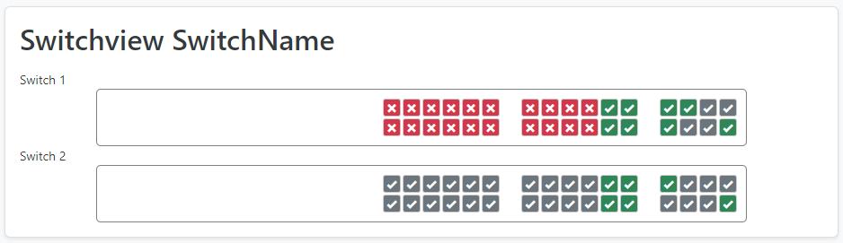

# NetBox Device View

Renders a visual front/rear panel of a device's physical ports and interfaces directly on the NetBox device detail page.

---

## Features

- **CSS Grid renderer** — works for any DeviceView, no extra setup
- **SVG renderer** — pixel-perfect scalable panels from a YAML layout
- **Port status colours** — green / yellow / grey / red based on connection state
- **Cable colour mode** — fills each port with the attached cable's colour
- **Module variants** — swap port layouts when a module is installed
- **Virtual Chassis** — renders each VC member as a separate panel
- **Patch panels** — front and rear faces rendered side by side

## Quick links

- [Installation](installation.md)
- [Configuration](configuration.md)
- [YAML Layout reference](layout-yaml.md)
- [SVG Renderer](svg-renderer.md)
- [Troubleshooting](troubleshooting.md)
