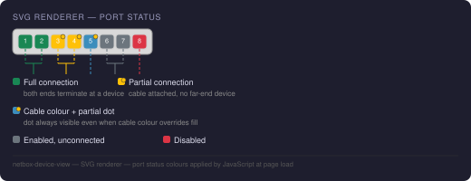

# SVG Renderer

The SVG renderer produces a scalable `<svg>` element from a [YAML layout](layout-yaml.md). It is available when a DeviceView has:

- **Render Mode** set to `svg`
- A non-empty **YAML Layout** field

If either condition is not met, the plugin silently falls back to CSS rendering.

---

## Enabling SVG mode

Set **Render Mode → SVG** on the DeviceView edit page. The field is available at *Plugins → Device Views → [edit]*.

!!! note
    Virtual Chassis devices render as one SVG panel per member (in rack order), each using that member's own device type's DeviceView — see [Virtual Chassis](virtual-chassis.md). SVG mode requires *every* member's device type to have a YAML-layout DeviceView; if any member is missing one, the whole device falls back to CSS.

---

## Port status colours

Each port is coloured at page load by a small JavaScript snippet based on its connection state. The SVG renderer emits only the structural skeleton; no colours are baked into the SVG source.



### States

| State | Colour | Condition |
|---|---|---|
| **Full connection** | Green `#198754` | `connected_endpoints` resolves to a far-end device interface |
| **Partial connection** | Yellow `#ffc107` + dot | Cable attached but path does not resolve to a device (e.g. switch → patch panel → open outlet) |
| **Enabled, unconnected** | Grey `#6c757d` | Port is enabled, no cable attached |
| **Disabled** | Red `#dc3545` | Port is administratively disabled |

### Partial connection indicator

A partially connected port has a cable attached (`link_peers` is non-empty) but the cable path does not reach a far-end device (`connected_endpoints` is empty). This is typical of:

- A switch port patched to a patch panel whose far end is not yet connected
- A port with a cable terminated at a wall outlet or keystone jack

The partial state is shown with:

1. A **yellow fill** on the port rect (in status-colour mode)
2. A **small warning dot** (yellow circle with dark stroke) in the top-right corner of the port rect — always visible, even when cable colour mode overrides the fill colour

### Cable colour mode

The **Cable Colors** checkbox on the device view page toggles cable colour mode. When enabled:

- Each port is filled with the hex colour of its attached cable
- Ports with a cable that has no colour set are shown with a grey/black diagonal stripe pattern
- The partial connection **dot overlay is still rendered** on top, so the partial state remains visible regardless of the cable colour

---

## SVG output structure

```xml
<svg class="dv-svg" viewBox="0 0 W H" xmlns="...">
  <defs>
    <!-- diagonal stripe pattern for cables with no colour set -->
    <pattern id="dv-nocolor-pattern" .../>
  </defs>

  <!-- canvas background -->
  <rect class="dv-canvas-bg" .../>

  <!-- port elements — status classes added by JS at page load -->
  <g class="dv-port {stylename}" data-stylename="{stylename}" tabindex="0" role="button">
    <title>{stylename}</title>
    <rect class="dv-port-rect" .../>
    <text class="dv-port-label" .../>
  </g>
  ...
</svg>
```

### CSS classes

| Class | Applied to | Meaning |
|---|---|---|
| `dv-svg` | `<svg>` | Outer SVG element |
| `dv-face-front` / `dv-face-rear` | `<svg>` | Patch panel face identifier |
| `dv-canvas-bg` | `<rect>` | Canvas background |
| `dv-port` | `<g>` | Any clickable port element |
| `{stylename}` | `<g>` | Derived port name — used by JS to apply status |
| `dv-port-rect` | `<rect>` | Port fill rectangle |
| `dv-port-label` | `<text>` | Abbreviated port label |
| `dv-spacer` | `<rect>` | Spacer element |
| `dv-blank` | `<rect>` | Blank decorative element |
| `dv-label` | `<text>` | Standalone text label |
| `bg-success` | `<g>` | Added by JS: full connection (green) |
| `bg-warning` | `<g>` | Added by JS: partial connection (yellow) |
| `bg-secondary` | `<g>` | Added by JS: enabled, unconnected (grey) |
| `bg-danger` | `<g>` | Added by JS: disabled (red) |
| `nocolor` | `<g>` | Added by JS: cable with no colour set (stripe pattern) |
| `dv-partial-dot` | `<circle>` | Added by JS: partial connection dot overlay |

---

## Coordinate formula

```
x = PADDING + (col - 1) × (cell_size + GAP)
y = PADDING + (row - 1) × (cell_size + GAP)
```

| Constant | Value | Description |
|---|---|---|
| `PADDING` | 6 px | Outer margin inside the SVG viewport |
| `GAP` | 2 px | Gap between cells |
| `CORNER_RADIUS` | 3 px | Border radius on port rects |
| `FONT_SIZE` | 7 px | Port label font size |
| `DEFAULT_CELL` | 32 px | Cell size used when `cell_size = 0` (patch panels) |

---

## Patch panels

Patch panels produce **two `<svg>` elements** — one with `data-face="front"` and one with `data-face="rear"`. Both are rendered side by side in a flex wrapper.

Use `cell_size: 0` in the YAML canvas to enable auto sizing for patch panels.

---

## Limitations

- Virtual Chassis SVG rendering requires every member's device type to have an SVG-capable DeviceView (see above) — one missing member falls the whole device back to CSS
- `cell_size: 0` (patch-panel auto sizing) uses `DEFAULT_CELL = 32 px` in SVG mode since CSS `auto` sizing has no SVG equivalent
